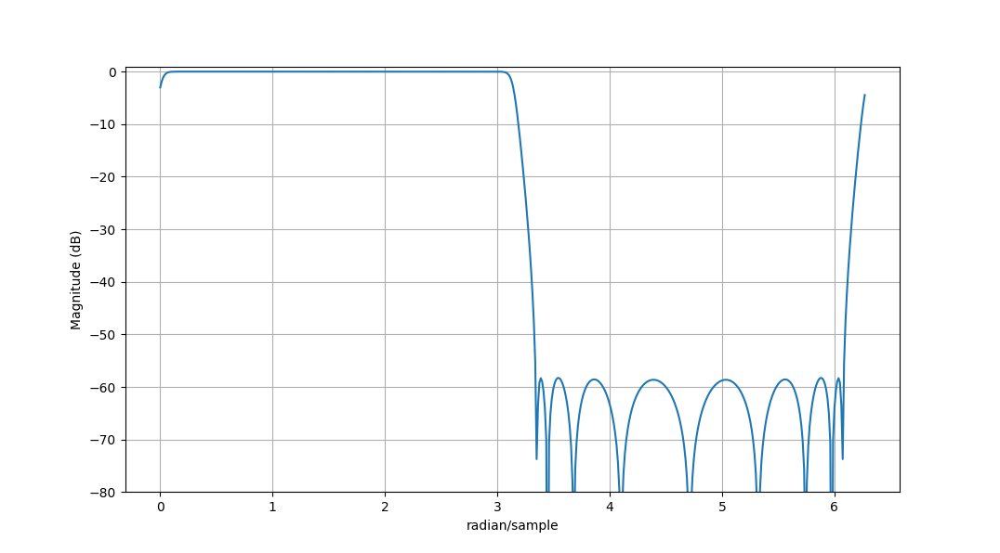

# Hilbert transformer filter design resources

This repo gathers code related to Hilbert transformer (FIR) filter design.

## Links

[An Efficient Analytic Signal Generator](http://www.claysturner.com/dsp/ASG.pdf)

[SciPy:Remez](https://docs.scipy.org/doc/scipy/reference/generated/scipy.signal.remez.html)

[SciPy:firwin2](https://docs.scipy.org/doc/scipy/reference/generated/scipy.signal.firwin2.html)

[Least-Squares Linear-Phase FIR Filter Design](https://ccrma.stanford.edu/~jos/sasp/Least_Squares_Linear_Phase_FIR_Filter.html)

## Plots

## Extras

The script `allpass_halfband_des.py` allows for designing an allpass IIR halfband filter
with following structure:

Number of sections in each branch is configurable. By default it is two.
Such filter can easily be converted to an allpass Hilbert transformer via the script `des_hilb_allpass.py`.

Halfband allpass IIR filter:

Allpass Hilbert transformer:

